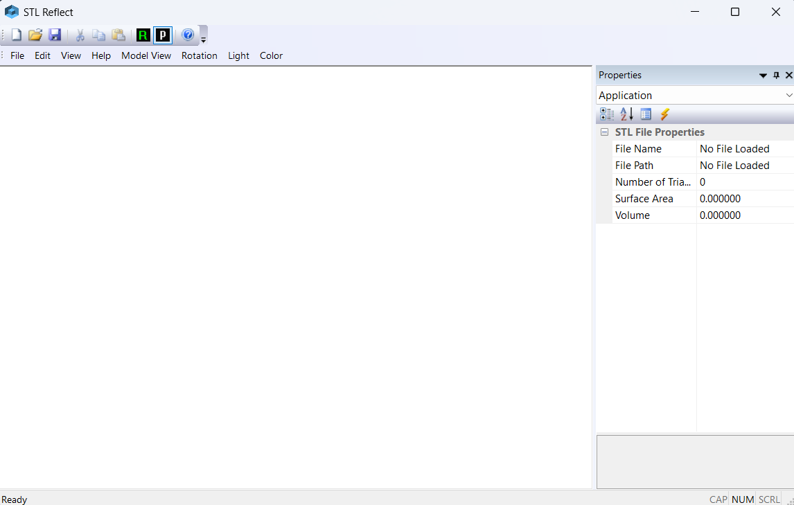
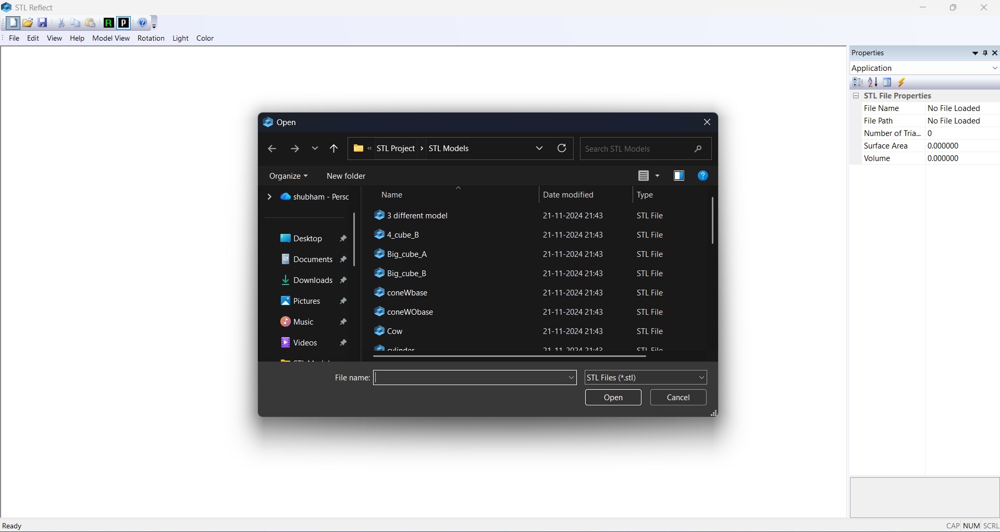
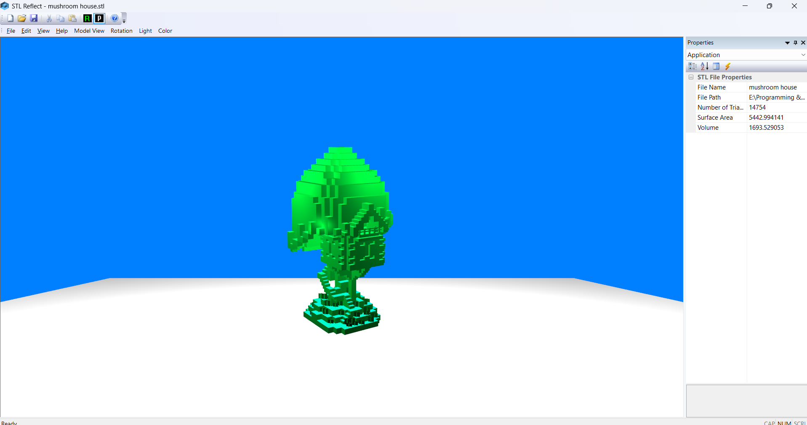
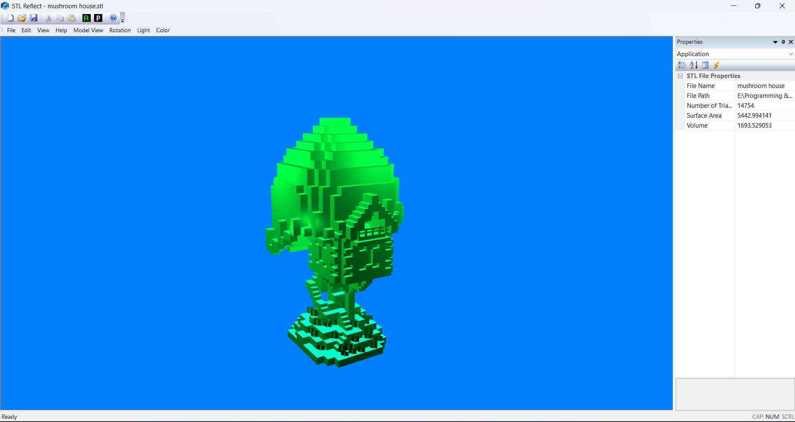

# STL Viewer (OpenGL)

A lightweight STL file viewer built using C++, OpenGL, and MFC.
This project focuses on rendering 3D geometry, parsing STL files, and building a basic CAD-style desktop viewer.

---

## 🚀 Features

* Supports ASCII & Binary STL files
* Real time 3D rendering using OpenGL
* Camera controls (zoom, rotate, pan)
* Shader based pipeline (GLSL)
* Efficient mesh handling using VAO & VBO
* Desktop UI built with MFC (Microsoft Foundation Classes)

---

## 🛠️ Tech Stack

* C++
* OpenGL
* GLFW
* GLAD
* GLM
* stb
* MFC (for UI framework)

---

## 🖥️ UI Framework

The application uses **MFC (Microsoft Foundation Classes)** to build a native Windows desktop interface.

Key UI components:

* Main frame window (`MainFrm`)
* Dockable panels (`MyDockablePane`)
* Rendering view (`STLReflectView`)
* Properties panel (`PropertiesWnd`)

This provides a structured CAD like interface along with OpenGL rendering.

---

## 📂 Project Structure

```
src/            → Source files (.cpp)
include/        → Header files (.h)
shaders/        → Vertex & Fragment shaders
resources/      → STL models / assets
Libraries/      → External dependencies (ignored in Git)
```

---

## ⚙️ Setup Instructions

### 1. Clone the repository

```
git clone https://github.com/ShubhamDevLab/stl-mesh-viewer.git
```

---

### 2. Setup Dependencies

This project uses external libraries which are **not included in the repo**.

Create this structure inside the project:

```
Libraries/
 ├── include/
 └── lib/
```

Then download and place:

#### 🔹 Headers → `Libraries/include/`

* glad
* GLFW
* glm
* stb

#### 🔹 Library → `Libraries/lib/`

* glfw3.lib

---

### 3. Open Project

* Open `STLReflect.sln` in Visual Studio
* Make sure MFC is installed in Visual Studio
* Build and run 🚀

---

## 🎯 Future Improvements

* Lighting (Phong / PBR)
* Wireframe mode
* GUI enhancements (ImGui integration or advanced MFC UI)
* Drag & drop STL loading
* Model transformations

---

## 📸 Preview

<p align="center">
  
  
  
  
</p>

---

## 👨‍💻 Author

Shubham Agrahari
Software Engineer | CAD & 3D Graphics Enthusiast
